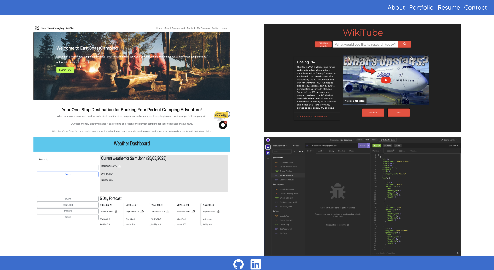

# React-Code-Portfolio

## Description:
  
This is my work-in-progress code portfolio created with react. This is where I'll show off my highlighted applications and code projects.. 
  - I am building this portfolio to aid in my search for a career in web development, following completion of the bootcamp.
  - Building this project so far I've learned how to conditioninally render react components.
  
## Installation:
This project can be viewed on github pages here: https://mo2207.github.io/React-Code-Portfolio/

## Usage:

## Credits:
I built this myself.

## License:
MIT license
